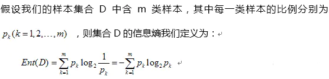

> 工作了一年多才深度理解熵的各种关系，因此梳理一下形成这篇博客

## 问题

1. 什么是信息熵，相对熵，交叉熵
2. KL散度到底是什么
3. 为什么在机器学习中分类任务经常用交叉熵作为损失函数来衡量一个算法的区别
4. 交叉熵和均方误差的区别和联系

我个人认为带着问题去思考会更有组与理解事情的本质，更容易聚焦

## 信息熵

**定义**

公式：

**信息熵表达了什么？**

- 信息量和事件发生的概率有关，事件发生的概率越低，信息熵越大。
- 信息熵非负，表明信息量不为0，因此信息熵是个常数。
- 信息量可以叠加，两个事件独立的联合事件，其信息熵为两者之和。

## 相对熵

**定义**

​	也称为KL散度，对于x有P(x)和P(y)两种分布,其公式为
$$
\begin{align*}
 D_{kl}(p||q) &=\sum_{i=1}^{n}p(x_{i})log(\frac{p(x_{i})}{q(x_{i})})  \\ 
 &=\sum_{i=1}^{n}p(x_{i})log(p(x_{i})-\sum_{i=1}^{n}p(x_{i})log(q(x_{i}) \\
 &=-H(x)+H(p,q)
\end{align*}
$$
前者是信息熵，后者就是我们常见的交叉熵

**相对熵表达了什么？**

1. 相对熵和交叉熵呈正比，因为信息熵是常数。
2. 相对熵主要用于评价两者分布之间的差异，相对熵越大，分布差距越大。

## 交叉熵

**为什么机器学习使用交叉熵**

在机器学习中，我们会将p(x)作为真实分布，q(x)作为预测分布，从相对熵的公式我们看出了相对熵和交叉熵的结果是呈正比的，有由于相对熵计算较为复炸，因此经常会有交叉熵来代替相对熵作为衡量真是分布和预测分布的差距。当然像VAE中用的就是KL散度我猜测是因为预测分布用的是（0，1）分布，可以比较方便使用。

**其和MSE的区别和联系**

**MSE**：用于回归任务

**交叉熵**：用于分类任务

由于交叉熵通常会和激活函数使用，如果用的是MSE在梯度传递过程中，容易出现梯度消失，因此比较多的会选用交叉熵+sigmod联合使用。

## Reference

[知乎1](https://zhuanlan.zhihu.com/p/70804197)

[知乎2](https://zhuanlan.zhihu.com/p/149186719)

